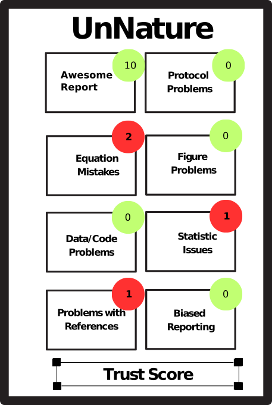
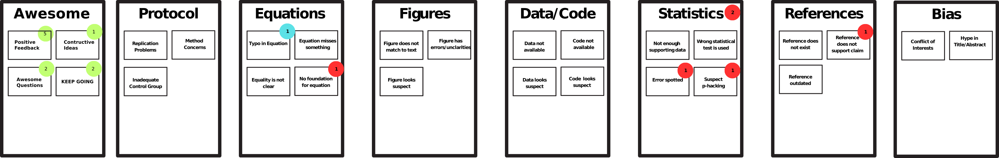
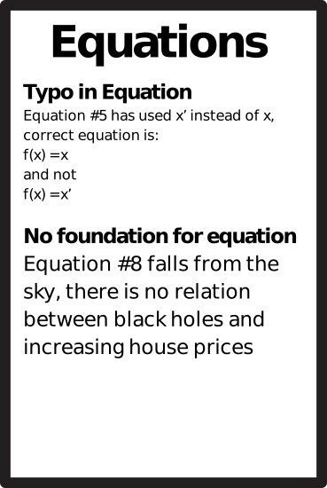

# some ideas for style and content for the extension

## Style
see the designs

## Ablauf

Trigger zum Start der Extension
a) Ich öffne eine Seite mit DOI in URL
b) Ich öffne eine Seite mit Journal name in URL
c) Ich klicke manuell auf die Extension  

App öffnet sich dann und man sieht

Dann hat man dort die verschiedenen rupriken, die man wiederum anklicken kann, wenn es informationen gibt. das sieht man hier

Und danach kann man die kategorien öffnen wenn man genaueres wissen will. Das kann dann so aussehen

wenn es nur einen oder zwei kommentare gibt kann man die auch direkt anzeigen, ohne dass man auf die rubriken klicken muss.

## Content

Das waren so die themengebiete an die ich gedacht habe. Fällt dir noch mehr ein?

a) vague or incomplete methods that make replication complicated/impossible
b) missing details about reagents/equipment/experimental conditions
c) skipping/unclear steps in the protocol
d) selective reporing/biased towards positive results while ignoring negative/inconclusive results
e) Figures that dont match the claims in the text
f) Figures that look suspect
g) point to things that sound “too good to be true”
h) missing/suspicious statistical tests or ones which lack statistical power / overgeneralize conclusions based on limited data
i) speculative conclusions not supported by data
j) reference to paper that is not supporting the claim
k) suspect p-hacking, lack of effect size or confidence intervals
L) use of wrong statistical tests (e.g. because data does not fulfill assumptions)
m) conflict of interest
n) inadequate control groups (or control not truly comparable to experiment)
o) error in equation
p) lack of validation or findings with independent datasets or methods
q) error in visualization
r) hype in abstract or title